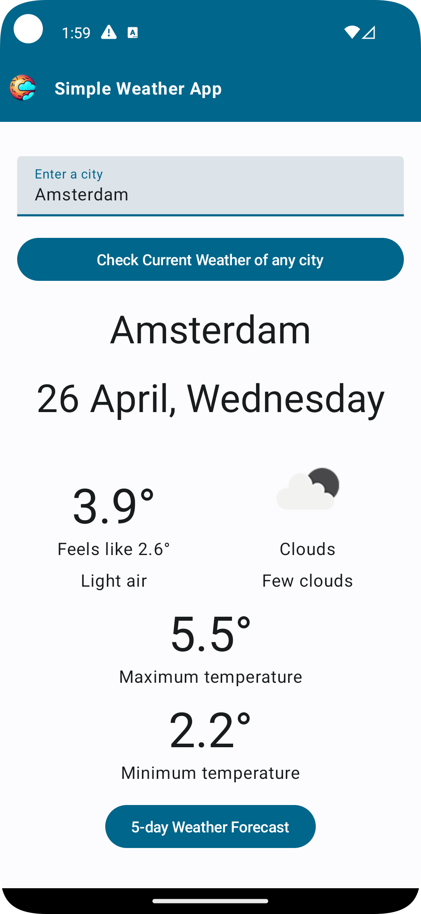
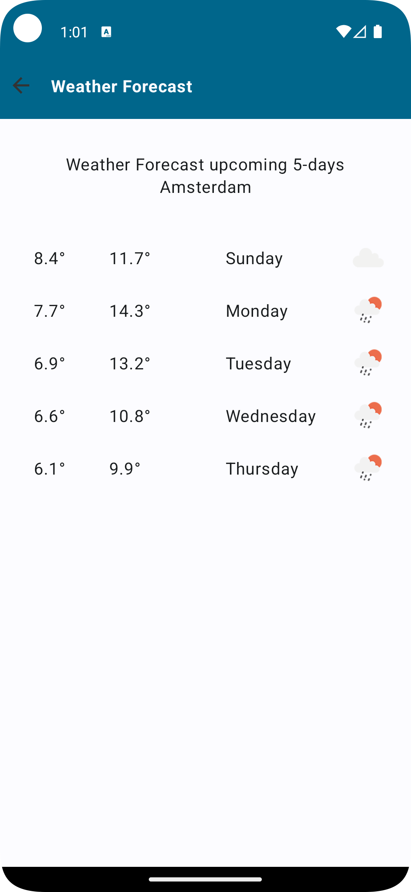

# Weather App
This is a simple weather app for Android built with Jetpack Compose in Clean Architecture and uses the Raamcosta Library for Navigation. 
The app displays the current weather and weather prediction in any city for the upcoming 5 days. 
It is designed to showcase how to use Jetpack Compose in combination with Clean Architecture to build a robust and scalable Android application.

## Installation
To build and run the app locally, follow these steps:

1. Clone the repository to your local machine using: 
git clone https://github.com/jkschermer/Simple-Weather-App.git
2. Open the project in Android Studio.

3. Build and run the app using the emulator or a physical device.

## Architecture
The app follows the principles of Clean Architecture, which is based on Separation of Concerns and Inversion of Control. It has three main layers:

**Presentation layer:** 
Handles UI components and user interactions. 
It uses Jetpack Compose to build the UI.

**Domain layer:** 
Defines the business logic of the app. 
It contains the use cases and entities.

**Data layer:** 
Handles data retrieval and persistence. 
It uses remote and local data sources 
to provide data to the app.

The app uses the following libraries:

**Jetpack Compose:** 
For building the UI.

**Koin:**
Dependency Injection and HTTP calls

**Coroutines:** 
For managing asynchronous operations.

**Raamcosta Navigation**
For navigating in a type-safe manner

## Features
The app has two screens:

## Current Weather Screen
This screen displays the current weather information, including the current weather conditions

## Weather Prediction Screen
This screen displays the weather prediction for the upcoming 5 days, including the day of the week, temperature, and weather condition.

## API
The app uses the OpenWeather API to retrieve weather data. To use the API, you'll need to obtain an API key from the OpenWeather website and add it to the local.properties file:
For fetching images of cities pixabay is being used. 

## Conclusion
This app serves as an example of how to build a well-structured and maintainable Android app using Jetpack Compose and Clean Architecture. 
